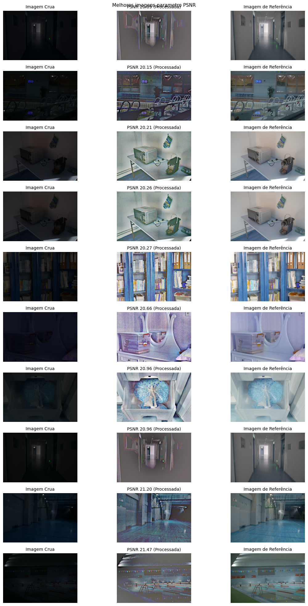
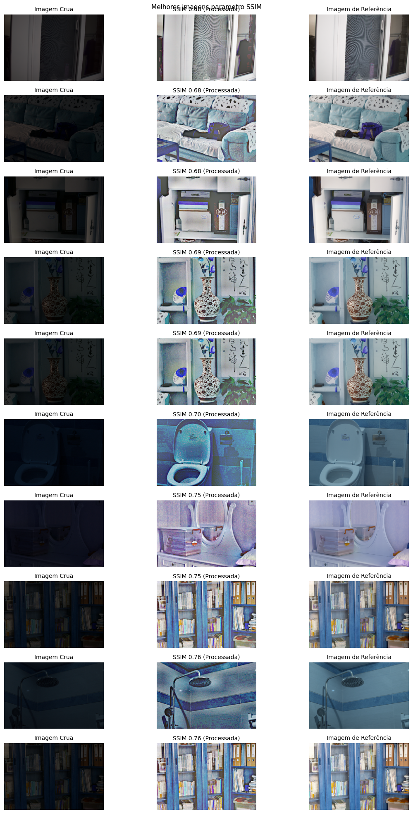
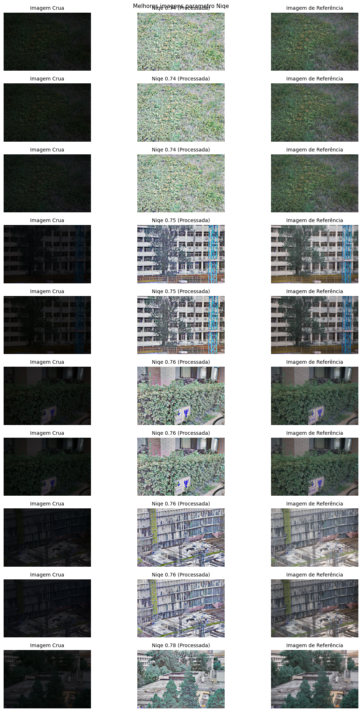
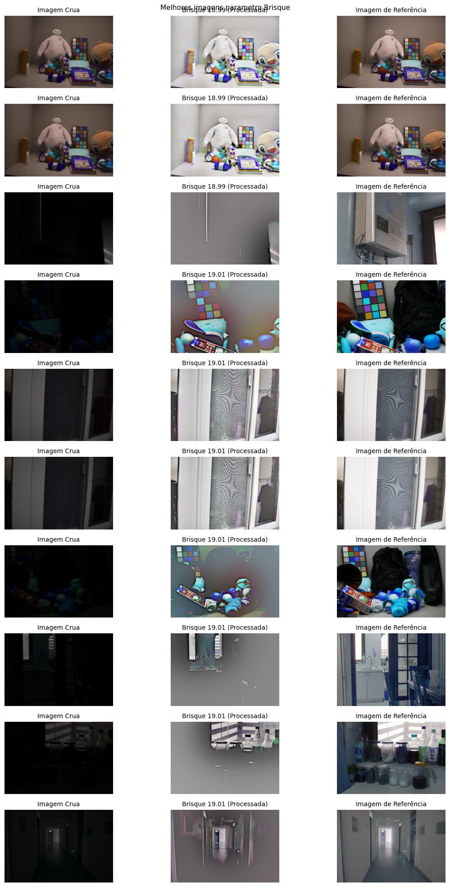

# Análise de Luminosidade - Motorola - Impactlab

## Nilton da Silva Nascimento

### Problemática

<p>A clareamento de imagens escuras é uma técnica comum no processamento de imagens que visa melhorar a visibilidade e revelar detalhes ocultos em áreas subexpostas. No entanto, essa prática não está isenta de desafios e pode acarretar diversos problemas que impactam a qualidade final da imagem. Um dos principais problemas é o aumento do ruído presente na imagem, uma vez que clarear as áreas escuras também amplifica os artefatos de ruído, resultando em uma degradação da qualidade visual. Problema que pode ser percebido nos exemplos abaixo.</p>

---

### Experimento

<p>A princípio, eu gostaria de testar a permutação de 7 funções de tratamento de imagem. Porém, considerando 7! = 5040, o tempo médio de 5 minutos no processamento de cada imagem e o total do dataset com cerca de 800 imagens, a execução iria demorar aproximadamente 14 mil dias.</p>

<p>Dado o problema acima, decidi testar a sequência de funções que faz mais sentido para o tratamento e correções de certos casos:</p>

<ul>
  <li>adaptive_histogram_equalization</li>
  <li>logarithmic_transformation</li>
  <li>gamma_correction</li>
  <li>bilateral_filter</li>
  <li>multi_scale_retinex</li>
  <li>color_correction</li>
  <li>sharpen_with_mask</li>
</ul>

---
### Como compilar?

<p>na base do diretoria raiz baixe o dataset https://drive.google.com/file/d/1psMH1-zmI4rVJVELxr0ErkhduqpzJXwb/view?usp=sharing e crie uma pasta "data" e insira os arquivos. De acordo com o nome desejado modifique o inicio do arquivo para encontrar a rota da imagem da label e com ruido</p>

---
### Resultados

<p>Os parâmetros dos valores utilizados na melhor métrica foram:</p>

```python
image = adaptive_histogram_equalization(image)
image = logarithmic_transformation(image, 0.8)
image = gamma_correction(image, 10)
image = bilateral_filter(image, 2, 300, 100) # diminuindo diameter
image = multi_scale_retinex(image, [6, 60, 125])
image = color_correction(image, 32)
```
# Resultados das Métricas

<p>A melhor sequência testada apresentou os seguintes valores no score:</p> <div> <p><strong>Resultados das Métricas ciclo 25:</strong></p> <ul> <li>PSNR Médio: 14.916848654521441</li> <li>SSIM Médio: 0.43887301056052486</li> <li>BRISQUE Médio: 19.037722610643304</li> <li>NIQE Médio: 0.8810591336391026</li> </ul> </div> <p>Gráficos ilustrativos dos resultados:</p> 

# As 10 melhores imagens de cada metrica

 
 
 
 



Aqui estão os resultados das métricas avaliadas para cada ciclo:

<table>
  <thead>
    <tr>
      <th>Ciclo</th>
      <th>PSNR Médio</th>
      <th>SSIM Médio</th>
      <th>BRISQUE Médio</th>
      <th>NIQE Médio</th>
    </tr>
  </thead>
  <tbody>
    <tr>
      <td>1</td>
      <td>10.5988</td>
      <td>0.4405</td>
      <td>19.0638</td>
      <td>0.9152</td>
    </tr>
    <tr>
      <td>2</td>
      <td>14.4523</td>
      <td>0.5110</td>
      <td>19.0504</td>
      <td>0.9203</td>
    </tr>
    <tr>
      <td>3</td>
      <td>6.5395</td>
      <td>0.2211</td>
      <td>19.0587</td>
      <td>0.9450</td>
    </tr>
    <tr>
      <td>4</td>
      <td>14.6329</td>
      <td>0.4095</td>
      <td>19.0796</td>
      <td>0.8490</td>
    </tr>
    <tr>
      <td>5</td>
      <td>12.8099</td>
      <td>0.2899</td>
      <td>19.0703</td>
      <td>0.9012</td>
    </tr>
    <tr>
      <td>6</td>
      <td>11.6109</td>
      <td>0.2433</td>
      <td>19.0802</td>
      <td>0.8697</td>
    </tr>
    <tr>
      <td>7</td>
      <td>11.2010</td>
      <td>0.1569</td>
      <td>19.1142</td>
      <td>0.6575</td>
    </tr>
    <tr>
      <td>8</td>
      <td>11.5860</td>
      <td>0.1620</td>
      <td>19.1120</td>
      <td>0.6722</td>
    </tr>
    <tr>
      <td>9</td>
      <td>11.5860</td>
      <td>0.1620</td>
      <td>19.1120</td>
      <td>0.6722</td>
    </tr>
    <tr>
      <td>10</td>
      <td>13.7329</td>
      <td>0.3322</td>
      <td>19.0817</td>
      <td>0.7833</td>
    </tr>
    <tr>
      <td>11</td>
      <td>10.5549</td>
      <td>0.1344</td>
      <td>19.1182</td>
      <td>0.6112</td>
    </tr>
    <tr>
      <td>12</td>
      <td>13.3246</td>
      <td>0.2881</td>
      <td>19.0943</td>
      <td>0.7515</td>
    </tr>
    <tr>
      <td>13</td>
      <td>12.7074</td>
      <td>0.3358</td>
      <td>19.0939</td>
      <td>0.7513</td>
    </tr>
    <tr>
      <td>14</td>
      <td>7.7273</td>
      <td>0.2647</td>
      <td>19.1073</td>
      <td>0.7491</td>
    </tr>
    <tr>
      <td>15</td>
      <td>7.1882</td>
      <td>0.2379</td>
      <td>19.1003</td>
      <td>0.7907</td>
    </tr>
    <tr>
      <td>16</td>
      <td>13.3426</td>
      <td>0.2765</td>
      <td>19.0915</td>
      <td>0.7763</td>
    </tr>
    <tr>
      <td>17</td>
      <td>13.4531</td>
      <td>0.2956</td>
      <td>19.0788</td>
      <td>0.7988</td>
    </tr>
    <tr>
      <td>18</td>
      <td>11.0291</td>
      <td>0.4055</td>
      <td>19.0439</td>
      <td>0.8488</td>
    </tr>
    <tr>
      <td>19</td>
      <td>13.4185</td>
      <td>0.2939</td>
      <td>19.0787</td>
      <td>0.7972</td>
    </tr>
    <tr>
      <td>20</td>
      <td>14.9160</td>
      <td>0.4622</td>
      <td>19.0265</td>
      <td>0.9061</td>
    </tr>
    <tr>
      <td>21</td>
      <td>11.8476</td>
      <td>0.4788</td>
      <td>19.0207</td>
      <td>0.8992</td>
    </tr>
    <tr>
      <td>22</td>
      <td>12.0465</td>
      <td>0.5247</td>
      <td>19.0102</td>
      <td>0.9061</td>
    </tr>
    <tr>
      <td>23</td>
      <td>14.8983</td>
      <td>0.4584</td>
      <td>19.0273</td>
      <td>0.9039</td>
    </tr>
    <tr>
      <td>24</td>
      <td>14.8971</td>
      <td>0.4583</td>
      <td>19.0273</td>
      <td>0.9039</td>
    </tr>
    <tr>
      <td>25</td>
      <td>14.9168</td>
      <td>0.4389</td>
      <td>19.0377</td>
      <td>0.8811</td>
    </tr>
  </tbody>
</table>

