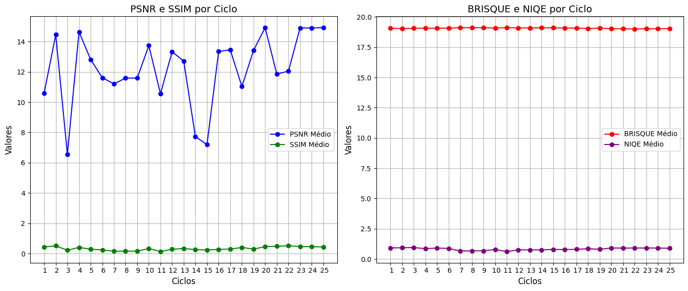

# Análise de Luminosidade - Motorola - Impactlab

## Nilton da Silva Nascimento

### Problemática

<p>A clareamento de imagens escuras é uma técnica comum no processamento de imagens que visa melhorar a visibilidade e revelar detalhes ocultos em áreas subexpostas. No entanto, essa prática não está isenta de desafios e pode acarretar diversos problemas que impactam a qualidade final da imagem. Um dos principais problemas é o aumento do ruído presente na imagem, uma vez que clarear as áreas escuras também amplifica os artefatos de ruído, resultando em uma degradação da qualidade visual. Problema que pode ser percebido nos exemplos abaixo.</p>

---

### Experimento

<p>A princípio, eu gostaria de testar a permutação de 7 funções de tratamento de imagem. Porém, considerando 7! = 5040, o tempo médio de 5 minutos no processamento de cada imagem e o total do dataset com cerca de 800 imagens, a execução iria demorar aproximadamente 14 mil dias.</p>

<p>Dado o problema acima, decidi testar a sequência de funções que faz mais sentido para o tratamento e correções de certos casos:</p>

<ul>
  <li>adaptive_histogram_equalization</li>
  <li>logarithmic_transformation</li>
  <li>gamma_correction</li>
  <li>bilateral_filter</li>
  <li>multi_scale_retinex</li>
  <li>color_correction</li>
  <li>sharpen_with_mask</li>
</ul>

---

### Resultados

<p>Os parâmetros dos valores utilizados na melhor métrica foram:</p>

```python
image = adaptive_histogram_equalization(image)
image = logarithmic_transformation(image, 0.8)
image = gamma_correction(image, 10)
image = bilateral_filter(image, 2, 300, 100) # diminuindo diameter
image = multi_scale_retinex(image, [6, 60, 125])
image = color_correction(image, 32)
```
<p>A melhor sequência testada apresentou os seguintes valores no score:</p> <div> <p><strong>Resultados das Métricas ciclo 25:</strong></p> <ul> <li>PSNR Médio: 14.916848654521441</li> <li>SSIM Médio: 0.43887301056052486</li> <li>BRISQUE Médio: 19.037722610643304</li> <li>NIQE Médio: 0.8810591336391026</li> </ul> </div> <p>Gráficos ilustrativos dos resultados:</p>     <p>Abaixo estão as métricas médias de diferentes ciclos:</p> <pre> === Resultados das Métricas ciclo 1 === PSNR Médio: 10.598844353483399 SSIM Médio: 0.44045560096943054 BRISQUE Médio: 19.06376636364926 NIQE Médio: 0.9152449948326965 === Resultados das Métricas ciclo 2 === PSNR Médio: 14.452315803319802 SSIM Médio: 0.5109691532805469 BRISQUE Médio: 19.050424466825373 NIQE Médio: 0.9202788266013754 === Resultados das Métricas ciclo 3 === PSNR Médio: 6.5394710880865405 SSIM Médio: 0.22108979199591433 BRISQUE Médio: 19.05871422388886 NIQE Médio: 0.9449762683901403 === Resultados das Métricas ciclo 25 === PSNR Médio: 14.916848654521441 SSIM Médio: 0.43887301056052486 BRISQUE Médio: 19.037722610643304 NIQE Médio: 0.8810591336391026 </pre>
